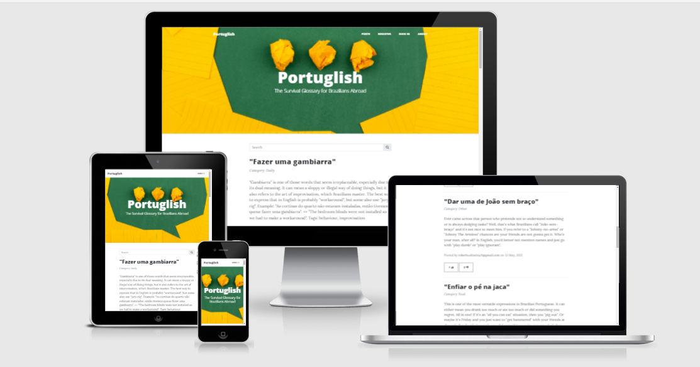
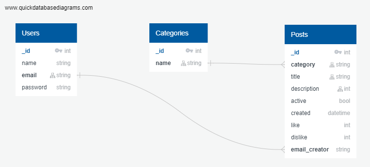

# PORTUGLISH

[LIVE SITE ON HEROKU](https://portuglish-app.herokuapp.com/)

### Overview
> Living abroad is quite an adventure. Expats, immigrants, globetrotters, digital nomads...whatever the definition we choose, one thing is certain: there will be lots of challenges. Other than being apart from beloved ones and starting a brand new life from scratch, one thing pervades every aspect of it  - language.

> Expressing ourselves precisely, as we would in our mother tongue, can be hard or even impossible in some cases. But why not take some fun and learn from it?

---

#### User Stories

##### General Users

> - "I came to Ireland to improve my English skills and I'm still learning how to express myself in everyday situations"
> - "I have an advanced English level and look for idioms and expressions to keep increasing my vocabulary"
> - "I find it hard to explain some thoughts and feelings when in a conversation, some words in Portuguese seem to be irreplaceable"
> - "I want my Irish friends and colleagues to better understand what I mean and I want to exchange culture about Brazil with them"
> - "I'm a languages enthusiast and love to learn new things while having fun"

##### Collaborators

> - “I’m interested in language/linguistics field and want to give my contributions in return to the many times I benefit from the content other people posted”

---

### UX

> This is a simple, easy-to-navigate and building glossary where you can search words and expressions by category, situation or sentiment. 
 
> The website targets Brazilians living in Ireland, but is also valuable to other portuguese speakers in English-speaking countries and English students willing to learn more about day-to-day language.
 
> As Brazil is a huge country and there are many different ways of speaking the same thing, the website values diversity and encourages people to give their contributions and even vote for the best translations and definitions.
Words can do harm, so to keep a safe environment for everyone, content will be moderated and there is a report function on every entry.

---

#### 1. Strategy

> The identity intends to be self-explanatory: the name, a combination of Portuguese and English, is a known expression (it even has an entry on Wikipedia!) and refers to the habit of mixing both languages in an attempt to express an idea. The subtitle is meant to be a funny hyperbole of the struggle many language learners go through, setting a friendly tone and clarity on what the website is about. The header image and colour code follows the Brazilian flag and brings vibrance to a very straightforward and clean template. 
 
> Speaking of colours, language is not a black or white sort of thing, so I deemed it relevant to give users the option to search not only alphabetically or by word, but also by category, situation or sentiment. Ideally, there would be many possible results to each of those filters, and that’s what makes user contribution so important to content relevance and diversity. 

> ##### Project Goals:
>
> - Build a community of collaborators to grow and enrich a glossary of popular Brazilian expressions and their equivalents in English
> - Become a reference for language learners and teachers 
> - Promote Brazilian language and culture to English native speakers
>
> ##### User Goals:
>
> - Easy and intuitive search for expressions, with accurate results
> - Learn through relevant content, based on real-life situations
> - Use the website as a device to teach or practise the passion for languages
>
#### 2. Structure
>
> - Thematic homepage, with Brazil references
> - Search bar with categories
> - Featured results
> - Option to register or log-in
> - Option to create, edit or delete a post
> - Social media links to follow and share content
>
#### 3. Scope
>
> The idea of this project is to provide the growing community of Brazilians living in Ireland (13,640 according to the Census 2016) with a tool to bridge the gaps between English and Brazilian Portuguese, making conversations richer and more enjoyable to everyone.
>
#### 4. Skeleton
>
> - [Wireframes](https://github.com/roliveira81/CI-MS3-Portuglish/blob/master/static/docs/portuglish_WF.pdf): desktop/mobile 
> - Website with 3 main sections: header, search bar, featured results, endless scroll
> - Fixed navigation bar (Home, About, Register) and Sign In function
> - Footer with copyright info and Social Media icons
>
#### 5. Surface
>
> For clean code purposes, I chose a Bootstrap template that perfectly matches the objectives of this website idea, with minor changes. 
> [Template Documentation](https://github.com/startbootstrap/startbootstrap-clean-blog)
>
> - Colours: a classy combination of Black, White and the vibrant Brazilian flag shades (Green 009c3b, Yellow ffdf00, Indigo Blue 002776)
> - Typography: fonts are clear, comfortable to the eye and make reference to writing/publishing universes.
> - Image: header image marks the website identity and the paper conversational balloon brings the idea of the ultimate purpose of language and the website itself.
>
### Features

##### Existing Features

> - Designed with HTML, CSS, JavaScript, Python+Flask, MongoDB.
> - [Posts](https://portuglish-app.herokuapp.com/index) - Home page with list of published posts and a Search bar ordered by creation date. It gives options to like or dislike any content.;
> - [About](https://portuglish-app.herokuapp.com/about) - About section is a static page to conceptualize the application idea: 
> - [Register](https://portuglish-app.herokuapp.com/register) - New User registration page;
> - [Sign In](https://portuglish-app.herokuapp.com/login) - Sign-In page and Sign out feature;
> - [New Post](https://portuglish-app.herokuapp.com/create_post) - Page for authenticated users to collaborate with the project creating relevant posts;
> - [Profile](https://portuglish-app.herokuapp.com/profile/Roberto%20Oliveira) - Profile page to allow collaborators to create, edit, activate, deactivate or delete posts;

##### Features left to Implement.
> In the future, it would be nice to implement the following features:

> - Search posts by category and tags
> - Allow visitors comments 

### Portuglish Database Model and Schema

> MongoDB is the NoSQL database technology used in the project.

##### Database Model

> Users
> - The Users collection contains information about the users with one to many relationship with the Posts model for the users who created posts.

> Categories
> - The category model contains a category name which is then referenced in the posts model.

> Posts
> - The Posts model contains the information for each post.
> - It also contains a relationship with the usermodel for the Post author field.
> - It contains one field linking categories to posts.
> - It contains one field linking users who have created posts.

### Technologies Used

##### 1. Languages

> - [HTML5](https://en.wikipedia.org/wiki/HTML5)
> - [CSS3](https://en.wikipedia.org/wiki/CSS)
> - [JavaScript](https://en.wikipedia.org/wiki/JavaScript) - JavaScript was used to manipulate html elements and bring interactivity.
> - [Python](https://en.wikipedia.org/wiki/Python_(programming_language)) - The main language was used to build the backend functionality of the web app.

##### 2. DataBase

> - [MongoDB](https://www.mongodb.com/) - Database technology used to store the application data.

##### 3. Flask and its extensions

> - [Flask](https://flask.palletsprojects.com/en/1.1.x/) - Flask micro framework was used to build the web app using python code.
> - [Flask-bcrypt](https://flask-bcrypt.readthedocs.io/en/latest/) - Flask bcrypt was used to has the users password before storing it in the database.
> - [Flask-mongoengine](http://docs.mongoengine.org/projects/flask-mongoengine/en/latest/) - A Flask extension that provides integration with MongoEngine.

##### 4. Frameworks and Libraries.

> - [StartBootstrap](https://startbootstrap.com/) - The clean Bootstrap theme used as the base of the site template.
> - [Bootstrap](https://getbootstrap.com/) - The world’s most popular front-end open source toolkit to quickly design and customize responsive mobile-first sites.
> - [Font Awesome](https://fontawesome.com/icons.com) - I used different icons from Line awesome for icons in the application.
> - [jQuery](https://jquery.com/) - "Clean Blog" built-in jQuery was used to initialize bootstrap functions.

##### 5. Workspace, version control, Repository storage

> - [VSCode](https://code.visualstudio.com/) - Main workspace IDE (Integrated Development Environment).
> - [LiveServer](https://marketplace.visualstudio.com/items?itemName=ritwickdey.LiveServer) - Launch a local development server with live reload feature for static & dynamic pages.
> - [Git](https://git-scm.com/) - Distributed Version Control tool to store versions of files and track changes.
> - [GitHub](https://github.com/) - A cloud-based hosting service to manage my **Git** repositories.
> - [Heroku](https://www.heroku.com/) - A cloud-based hosting service to deploy, publish and host the application.

##### 6. Other

> - [Am I responsive](http://ami.responsivedesign.is/) - Am I responsive was used to taking screenshots of the page at different screen sizes.
> - [Autoprefixer](https://autoprefixer.github.io/) Parses CSS and adds vendor prefixes.
> - [Google Mobile-Friendly Test](https://search.google.com/test/mobile-friendly) Mobile-friendly check on site.
> - [Website Page Test](https://www.webpagetest.org/) Runs a website speed test from multiple locations around the globe using real browsers (IE and Chrome) and at real consumer connection speeds.
> - [Online-Spellcheck](https://www.online-spellcheck.com/) Online spelling and grammar checks.
> - [Quick Database Diagrams](https://www.quickdatabasediagrams.com/) - I used quick database diagrams to make a digram of my database schema.
> - [Balsamiq](https://balsamiq.com/) - Balsamiq was used to create Wireframes for the project during the initial planning stage.
> - [RandomKeyGen](https://randomkeygen.com/) - Keygen Generator for app secret key.  

---

### Resources

> - [Code Institute Course Content](https://courses.codeinstitute.net/) - Main source of fundamental knowledge.
> - [Stack Overflow](https://stackoverflow.com/) - General resource, mainly for MongoDB query questions.
> - [Bootstrap](https://getbootstrap.com/) - Resource of icons, form and modal elements. 
> - [CSS-Tricks](https://css-tricks.com/) - General resource.
> - [w3schools.com](https://w3schools.com.com/) - General resource.
> - [Am I Responsive](http://ami.responsivedesign.is/) - Responsive website mockup image generator.
> - [Balsamiq](https://balsamiq.com/wireframes/) - Wireframing design tool.
> - [VisualStudio Code](https://code.visualstudio.com/docs/python/tutorial-flask-) - How to set up a Python/Flask environment locally.

---

### TESTING

> In general, the application was stressed by hitting all the links and simulating navigation as follow:

> As a user, I started navigating the website on the homepage, and scrolled to see the posts displayed. I tried the search bar and noticed there's a minimum of 3 characters to perform it. It brought back the results I was expecting, ordered chronologically from the newest to the oldest. 
Like and dislike features were working fine.
 
> I then tried the Register button, which led to a very straightforward form to sign up to the website and collaborate as a creator. 
The next step was creating a post, where you can choose among several categories, including  an "Other" option for cases where none of them fits. After creating an entry, I tested editing and deleting through the available buttons and they worked OK, retrieving a message to sign it was successful.

> Then, I navigated through the About session, which was not very long and easy to read. Social Media links on every page are handy for those interested in more. 
Finally, just clicking on the Sign Out on top of the page logged me out of the profile. 
No issues raised. 

> For those who want to test the application, I recommend go to Register section, create an app account and interact with the app as a "Collaborator".

> #### HTML
>
> - Ran HTML code through [HTML Validator](https://validator.w3.org/) 
> - Browse compatibility check
>   
> #### CSS
> - Ran CSS code through [CSS Validator](https://jigsaw.w3.org/css-validator/). The errors found comes from the core of bootstrap template, which cannot be changed.
> 
> #### RESPONSIVENESS
>
> - Application tested on all different sizes by Google DevTools: from 360 x 640 up to 1024 x 1366.
> - Viewed site on above range (including Responsive mode) on : Google Chrome, Edge
> - Viewed on physical devices: large phone (414px) | large tablet (768px) | Medium laptop (1366px) | Large Desktop screen (1920px)
> - By the fact it was used on this project a homologated bootstrap template, no changes on building templates caused any harm to the navite responsiveness capability, which means
that all responsivess capabilities inherited from the "Clean Blog" StartBootstrap template were preserved and checked by navigation tests in different types of devices.
> 
> #### PYTHON3 VALIDITY
>
> - Readability, code smells, logical meaning and indentation of the code was checked by PEP8 online tool with 100% of approve.
> - No one  errors were left, which shows a great cohesion of the code.
> - Based on the performed tests and described on Testing section of this document, no application bugs or exception messages were found or left, ensuring the consistency of the code.

---

### Version Control

> - Used Git for version control.

---

### Deployment

This project has been deployed based on Github, Git and Herokuon Cloud Plataform integration, on the following process:

- Install the following libraries: python and flask
    [Python Local Environment](https://code.visualstudio.com/docs/python/tutorial-flask)
    `pip3 install flask`

- Generate a **requirements.txt** file to allow Heroku to install the dependencies required to run the app (this file needs to be updated every new dependency installed).
    `pip freeze > requirements.txt`

- Create a **Procfile** with the command:
    `echo web: python app.py > Procfile`

- Create an account on the [Heroku website](https://signup.heroku.com/).
    - Login to the account, click on new and then create a new app. In the following screen, you need to give a name and choose the Europe region.
    - In the menu access the **Deploy** option, after that click on Connect to Github. Just below provide the information from the app's repository on GitHub and select the option Enable Automatic - On the Dashboard of the APP, click on Settings and then click on the option **Reveal config Vars**.
    - Now you need to add the following variables to **Reveal config Vars**:
        - **IP**: `0.0.0.0`
        - **PORT**: `5000`
        - **MONGO_URI**: `link to your Mongo DB`
        - **SECRET_KEY**: `your chosen secret key`

- Create a MongoDB on [MongoDB website](https://account.mongodb.com/).
    - Create a shared cluster tier, a cloud provider and set the Europe region;
    - Once the cluster is created, create a new database and set the database user privileges to read and write to the database;
    - Create database collections;
    - Connect the database to the application;
    - Set the environmental variables from the app;

- Install the following libraries: flask-pymongo and dnspython
		`pip3 install flask-pymongo`
		`pip3 install dnspython`

- Then, the app is available live on Heroku.

* To run local, set the SSL LOCAL=true [Resource](https://stackoverflow.com/questions/54484890/ssl-handshake-issue-with-pymongo-on-python3)

---

### Credits

> ##### Media
>
> - Header imagem: It was took from [Unsplash photos](https://unsplash.com/photos/V5vqWC9gyEU) by Volodymyr Hryshchenko.

> ##### Content
>
> - Most of the content was written by my wife, Bianca Aragone, which has helped hugely checking and creating most of the posts and section "About" definition.
>
> ##### Code Snippets
>
> - Modal html alert message functionality and it launch on screen was took from [Bootstrap](https://getbootstrap.com/). 

---